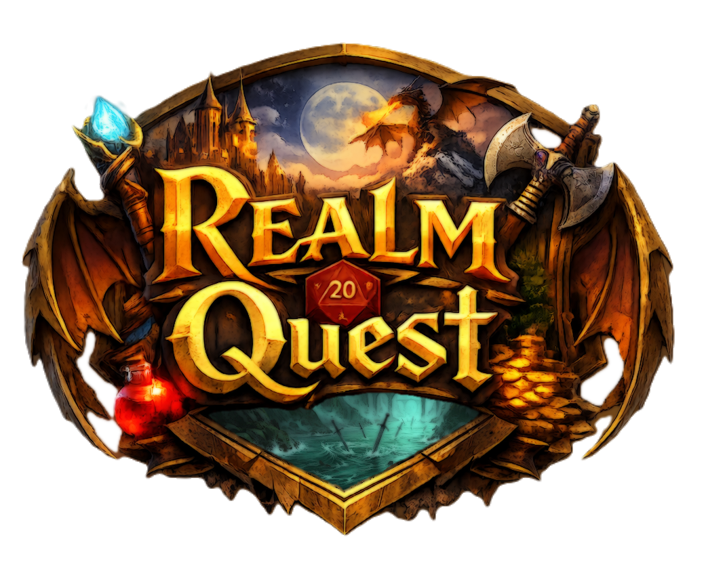

<div align="center">



#

A self-hosted, Docker-based **Discord AI DM** stack with a **Portal UI**, **API**, **Bot**, **Audio Matrix**, **Neural Config**, **Logs**, and campaign + data separation.

<!-- Buttons (style inspired by https://gist.github.com/rxaviers/7360908) -->
<a href="#quickstart"></a>
<a href="#docker-stack"></a>
<a href="#directory-layout"></a>
<a href="#configuration"></a>

<br/>

<a href="https://github.com/To3Knee/RealmQuest"></a>


</div>

---

## What RealmQuest Does

RealmQuest is a Docker stack that runs:

- **Portal UI** (web dashboard):  
  - **Neural Config**: view/edit runtime configuration from `.env` (with lock/unlock).  
  - **Audio Matrix**: configure DM voice/name (wake-word style), archetype voices, and soundscape triggers.  
  - **Logs**: view container logs from the Portal.  
  - **Discord Uplink**: display channel presence/roster and Discord-related status.

- **API** (FastAPI): serves system config, env endpoints, audio endpoints, log + control endpoints, discord roster endpoints, etc.
- **Bot** (Discord): connects to voice + guild, processes events, and exposes status/roster to the API/Portal.
- **Scribe**: auxiliary service used by the bot stack (voice/transcription pipeline integration).
- **Kenku**: audio service used for tracks/media (soundscapes).
- **MongoDB**: persistent system configuration store (e.g., `audio_registry`).
- **Redis**: shared cache/coordination.
- **ChromaDB**: RAG / memory backend.

---

## Docker Stack

### Services (docker-compose)
Typical containers:
- `realmquest-portal` — Portal UI (Vite/React)
- `realmquest-api` — FastAPI backend
- `realmquest-bot` — Discord bot worker
- `realmquest-scribe` — Scribe service
- `realmquest-kenku` — Kenku audio service
- `realmquest-mongo` — MongoDB
- `realmquest-redis` — Redis
- `realmquest-chroma` — ChromaDB

### Default ports
(Your compose may differ—check `docker-compose.yml`.)
- Portal: `http://<host>:3000`
- API: `http://<host>:8000`
- Scribe: `http://<host>:9000`
- Kenku: `http://<host>:3333`
- Chroma: `http://<host>:8002` (common host mapping)

---

## Directory Layout

RealmQuest is designed to keep **code**, **campaign content**, and **data** separated.

Recommended layout:

```

/opt/
RealmQuest/                # this repository (docker stack + portal + api)
RealmQuest-Campaigns/      # campaigns, worlds, content packs
RealmQuest-Data/           # persistent runtime data (db volumes, indexes, etc.)

````

In practice:
- **RealmQuest (repo)** contains:
  - `docker-compose.yml`
  - `portal/` (UI)
  - `api/` (FastAPI backend)
  - bot + service components (as defined by your images/build)

- **RealmQuest-Campaigns** contains:
  - campaign folders (e.g., `the_collision_stone/`)
  - assets, prompts, lore, NPC packs, etc.

- **RealmQuest-Data** contains:
  - database volumes (Mongo/Redis/Chroma)
  - any persistent media/index storage you mount

---

## Quickstart

### 1) Clone the repo
```bash
cd /opt
git clone https://github.com/To3Knee/RealmQuest.git
cd RealmQuest
````

### 2) Create the companion directories

```bash
mkdir -p /opt/RealmQuest-Campaigns
mkdir -p /opt/RealmQuest-Data
```

### 3) Create your `.env`

If you have an example file, use it:

```bash
cp .env.example .env
```

Otherwise, create `.env` and set at minimum:

* `DISCORD_TOKEN`
* `ADMIN_PIN` (for Neural Config lock/unlock)
* provider keys (Gemini/OpenAI/ElevenLabs) as applicable
* paths for campaigns/data if your compose expects them

> Security note: **Never commit `.env`** (this repo should have it ignored in `.gitignore`).

### 4) Start the stack

```bash
docker compose up -d --build
```

### 5) Verify health

```bash
docker ps
curl -sS http://localhost:8000/system/config | head
curl -sS http://localhost:3000/api/system/config | head
```

Open:

* Portal: `http://<host>:3000`

---

## Portal Features

### Neural Config (env editor + auth lock)

Neural Config is used to **view and edit** values loaded from `.env` through the API.

* If locked, you must unlock with the **Admin PIN**
* The **Lock** action should:

  * lock the view
  * allow re-authentication by re-showing the PIN prompt (not a blank screen)

Expected API endpoints (proxied through the portal):

* `GET /system/env/all` — list env keys/values (or redacted as you choose)
* `POST /system/auth/lock` — lock the portal
* `POST /system/auth/unlock` — unlock with PIN
* `GET /system/auth/status` — locked/has_pin state

### Audio Matrix (DM voice/name + triggers)

Audio Matrix manages `config.audio_registry`:

* **dmName**: the bot’s display name / “wake word” label used across UI + flows
* **dmVoice**: voice id used for DM narration
* **archetypes**: list of NPC archetype voice mappings
* **soundscapes**: list of ambient track trigger mappings

Expected behavior:

* “Add Trigger” creates a new editable entry immediately
* New entries must be **renameable** (id/label) and selectable for voice/track
* Changes persist via API save endpoint (Mongo-backed)

Expected endpoints:

* `GET /system/config`
* `POST /system/audio/save`
* `GET /system/audio/voices`
* `GET /system/audio/kenku/tracks`

### Logs (container logs + restarts)

Logs view pulls logs from the API which reads Docker logs via the socket.

Expected endpoints:

* `GET /system/control/logs/<service>`
* `POST /system/control/restart/<service>`

---

## Pangolin / Reverse Proxy Notes

If you route RealmQuest through a reverse proxy (e.g., Pangolin), you typically need:

* Portal reachable externally (HTTP/S)
* Correct proxying for:

  * `/api/*` → portal should forward to API (or proxy directly to API)
  * WebSockets if used by your UI (Vite dev uses HMR; production build may not)
* Consistent host/origin handling (CORS and Vite proxy settings)

**Is it required?**
No—RealmQuest runs directly on LAN ports via Docker Compose. A reverse proxy is optional if you want:

* TLS/HTTPS
* single entrypoint domain
* external access

---

## Common Commands

### Restart the stack

```bash
docker compose restart
```

### Follow logs

```bash
docker logs -f realmquest-api
docker logs -f realmquest-portal
docker logs -f realmquest-bot
```

### Bring down cleanly

```bash
docker compose down
```

---

## Troubleshooting

### Portal shows Offline

Usually the Portal cannot reach the API. Verify:

* API container is running
* Vite proxy target (or portal runtime config) points to the correct API host
* `curl http://<host>:8000/system/config` succeeds

### Logs show “No logs available.”

Verify:

* API container has access to Docker socket:

  * `/var/run/docker.sock` mounted
  * permissions allow reads

### Audio Matrix is blank

Typically caused by:

* API returning missing/invalid config fields
* UI error due to `audio_registry` shape mismatch
* Kenku tracks endpoint returning unexpected structure

Check:

```bash
curl -sS http://<host>:3000/api/system/config | jq '.audio_registry'
curl -sS http://<host>:3000/api/system/audio/voices | head
curl -sS http://<host>:3000/api/system/audio/kenku/tracks | head
```

### Discord Uplink shows wrong users / random channels

Verify:

* Bot is connected to the expected guild + voice channel
* API endpoint for members is keyed to the correct channel id/config
* Your `.env` contains the intended channel identifiers (if applicable)

---

## Security

* Treat `.env` as **secret** (tokens/API keys).
* Prefer a reverse proxy + HTTPS if exposing externally.
* Consider redacting sensitive keys in Neural Config display if you share access.

---

## Development Notes

* Portal: React + Vite (dev server in container)
* API: FastAPI (uvicorn)
* Data persistence: Mongo + Chroma + optional mounted volumes

---

## License


